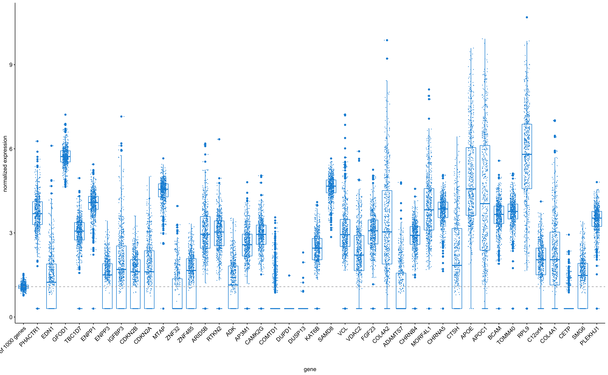

# Microanatomy of the human atherosclerotic plaque by single-cell transcriptomics

_Authors_: Marie AC Depuydt, Koen HM Prange, Lotte Slenders, Tiit Örd, Danny Elbersen, Arjan Boltjes, Saskia CA de Jager, Folkert W Asselbergs, Gert Jan de Borst, Einari Aavik, Tapio Lönnberg, Esther Lutgens, Christopher K Glass, Hester M. den Ruijter, Minna U Kaikkonen, Ilze Bot, Bram Slütter, Sander W van der Laan, Seppo Yla-Herttuala, Michal Mokry, Johan Kuiper, Menno PJ de Winther, Gerard Pasterkamp.

This repository holds all scripts used to analyze data and create figures presented in ["Microanatomy of the human atherosclerotic plaque by single-cell transcriptomics"]().

> # Abstract
> 
> **Rationale:** Atherosclerotic lesions are known for their cellular heterogeneity, yet the molecular complexity within the cells of human plaques have not been fully assessed. 

> **Objective:** Using single-cell transcriptomics and chromatin accessibility we gained a better understanding of the pathophysiology underlying human atherosclerosis.

> **Methods and Results:** We performed single-cell RNA and single-cell ATAC sequencing on human carotid atherosclerotic plaques to define the cells at play and determine their transcriptomic and epigenomic characteristics. We identified 14 distinct cell populations including endothelial cells, smooth muscle cells, mast cells, B cells, myeloid cells, and T cells and identified multiple cellular activation states and suggested cellular interconversions. Within the endothelial cell population we defined subsets with angiogenic capacity plus clear signs of endothelial to mesenchymal transition. CD4+ and CD8+ T cells showed activation-based subclasses, each with a gradual decline from a cytotoxic to a more quiescent phenotype. Myeloid cells included two populations of pro-inflammatory macrophages showing IL1B or TNF expression as well as a foam cell-like population expressing TREM2 and displaying a fibrosis-promoting phenotype. ATACseq data identified specific transcription factors associated with the myeloid subpopulation and T cell cytokine profiles underlying mutual activation between both cell types. Finally, cardiovascular disease susceptibility genes identified using public GWAS data were particularly enriched in lesional macrophages, endothelial and smooth muscle cells. 

> **Conclusion:** This study provides a transcriptome-based cellular landscape of human atherosclerotic plaques and highlights cellular plasticity and intercellular communication at the site of disease. This detailed definition of cell communities at play in atherosclerosis will facilitate cell-based mapping of novel interventional targets with direct functional relevance for the treatment of human disease.

You can opt to add a figure from the manuscript just to prettify the readme.

**Figure 1: Overall expression of target genes in carotid plaques from the Athero-Express Biobank Study**

# Scripts
These are just examples - should be edited at will

* `script_blabla.r` : used for quality control of scRNAseq data
* `script_figure.r` : used to create figure 1

--------------

#### The MIT License (MIT)
##### Copyright (c) 1979-2020

Permission is hereby granted, free of charge, to any person obtaining a copy of this software and associated documentation files (the "Software"), to deal in the Software without restriction, including without limitation the rights to use, copy, modify, merge, publish, distribute, sublicense, and/or sell copies of the Software, and to permit persons to whom the Software is furnished to do so, subject to the following conditions:   

The above copyright notice and this permission notice shall be included in all copies or substantial portions of the Software.

THE SOFTWARE IS PROVIDED "AS IS", WITHOUT WARRANTY OF ANY KIND, EXPRESS OR IMPLIED, INCLUDING BUT NOT LIMITED TO THE WARRANTIES OF MERCHANTABILITY, FITNESS FOR A PARTICULAR PURPOSE AND NONINFRINGEMENT. IN NO EVENT SHALL THE AUTHORS OR COPYRIGHT HOLDERS BE LIABLE FOR ANY CLAIM, DAMAGES OR OTHER LIABILITY, WHETHER IN AN ACTION OF CONTRACT, TORT OR OTHERWISE, ARISING FROM, OUT OF OR IN CONNECTION WITH THE SOFTWARE OR THE USE OR OTHER DEALINGS IN THE SOFTWARE.

Reference: http://opensource.org.

